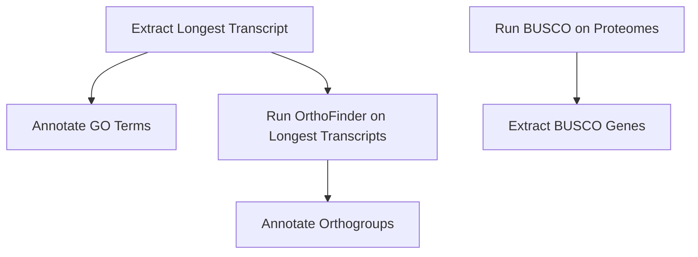

# Gene Family Evolution in _Daphnia_

This repository analyzes gene family dynamics in _Daphnia_ species, focusing on gene family expansion and contraction related to ecological adaptation and evolutionary innovation.

## Pipeline Overview



## Set-Up
- Download updated protein coding GTFs from NCBI and genomes and determine your appropriate in-group and out-group species.

## BUSCO
- BUSCO assesses the completeness of _Daphnia_ genome assemblies and annotations by evaluating conserved single-copy orthologs.

## Orthologs
- _OrthoFinder_ detects orthologs within and across _Daphnia_ species to understand evolutionary relationships.

## Phylogenomics
- Phylogenomic analysis infers evolutionary relationships and dynamics within _Daphnia_ species using _MCMCtree_ on BUSCO genes.

## Gene Family Evolution
- This section explores gene family expansion and contraction across _Daphnia_ species, focusing on genes related to spermatogenesis and stress responses using _Cafe5_ and _ClusterProfiler_.

## Selection
- Selection analysis investigates evolutionary pressures on specific gene families, particularly those undergoing expansion, using codon-based models like _PAML_ and _HyPhy_.

## Notes
- While I am using ``` apptainer run latest_image.sif``` for most processes, you could modify the code to run ``` apptainer exec docker://image:latest ``` so you do not have to pull images. 