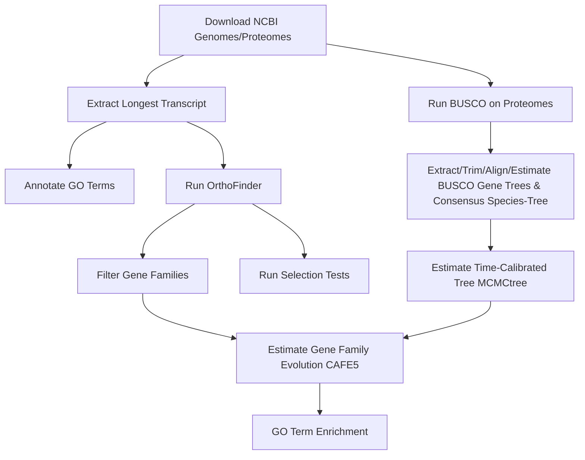

# Gene Family Evolution in _Daphnia_


This repository analyzes gene family dynamics in _Daphnia_ species, focusing on gene family expansion and contraction related to ecological adaptation and evolutionary innovation. This pipeline can be applied to any combination of species that is well-annotated (or custom gene models!) within the NCBI genome catalog. 

## Pipeline Overview


## Set-Up
- Download updated protein coding GTFs from NCBI and genomes and determine your appropriate in-group and out-group species for biological hypothesis testing.

## BUSCO
- BUSCO assesses the completeness of _Daphnia_ genome assemblies and annotations by evaluating conserved benchmark universial single-copy orthologous genes.

## Orthologs
- _OrthoFinder_ detects orthologs within and across _Daphnia_ species to understand evolutionary relationships.

## Phylogenomics
- Phylogenomic analysis infers evolutionary relationships and dynamics within _Daphnia_ species using _MCMCtree_ on BUSCO genes.

## Gene Family Evolution
- This section explores gene family expansion and contraction across _Daphnia_ species, focusing on genes related to spermatogenesis and stress responses using _Cafe5_ and _ClusterProfiler_.

## Selection
- Selection analysis investigates evolutionary pressures on specific gene families, particularly those undergoing expansion, using codon-based models like _PAML_ and _HyPhy_.

## Building the Apptainer Image

To build the Apptainer image, use the following command:

```bash
apptainer build gene_family_evolution.sif definition.def
```

## Running the Nextflow Pipeline

To run the Nextflow pipeline, use the following command:

```bash
nextflow run main.nf -profile standard
```

Ensure that the `nextflow.config` file is in the same directory as `main.nf` or specify its path using the `-c` option.

## Notes
- While I am using `apptainer run latest_image.sif` for most processes, you could modify the code to run `apptainer exec docker://image:latest` so you do not have to pull images. I am currently editing this feature so it is more user-friendly.
- This is currently a work-in-progress project and I am learning best practices with NextFlow in general, any help or tips would be appreciated!

### TimeTree Constraints
- TimeTree constraints are used to calibrate the phylogenetic tree with divergence times obtained from the TimeTree database. These constraints help in estimating the divergence times between species accurately.
- In the pipeline, the `makeConsensusMCMC` process includes the application of these constraints using the `mcmctree_prep.py` script. This script adds time constraints to the species tree based on known divergence times.

#### Example: Time between _Daphnia magna_ and _Drosophila melanogaster_
- The divergence time between _Daphnia magna_ and _Drosophila melanogaster_ is constrained between 474.8 and 530 million years.
- This constraint is applied in the `makeConsensusMCMC` process as follows:
  ```bash
  python ${params.scripts_dir}/mcmctree_prep.py \
      --left_species magna \
      --right_species melanogaster \
      --lower_bound 474.8 \
      --upper_bound 530 \
      --tree - \
  ```

## License
This project is licensed under the MIT License.
